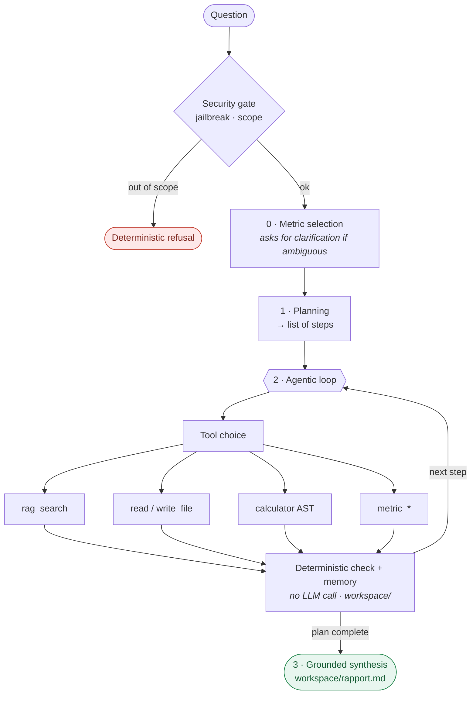

# Modular Agent

**A fund-analysis agent that plans, picks its own tools, and never invents a number.**

[](https://github.com/matteo799/agent-modulaire/actions/workflows/ci.yml)


A minimal agent, **hand-written without any agentic framework** (no LangChain, no AutoGPT),
that turns a classical RAG pipeline into an **agentic** system: the LLM plans, chooses its
tools, executes in a loop, keeps a working memory on disk, and produces a final, sourced
answer. RAG is no longer the core of the system — it is **one tool among 28**.

> The documentation is in French; this README and [`docs/benchmarks.md`](docs/benchmarks.md)
> are in English. The domain is French retail-fund regulatory documents, so the corpus,
> prompts and design notes are French by nature.

---

## Why this exists

A fund analyst answering a client question has to do three things a retrieval system alone
cannot do: pull a figure from a regulatory document (KID/DICI), **compute** something from a
NAV history, and produce a written deliverable — often chaining several of these.

> *"Compare the management fees of three funds in the corpus, compute the spread in
> percentage points between the most and least expensive, and write a report recommending
> the cheapest."*

Plain RAG cannot express this task at any retrieval quality. It has no way to chain three
scoped retrievals, feed the results into a calculation, and emit a file. That gap — not a
desire to build an agent — is the reason there is a planner and a tool loop here.

The binding constraint is that **a wrong number is worse than no number**. A KID does not
contain a return series, so most risk ratios genuinely cannot be computed from it. The
system is built so that this ends in an honest refusal rather than a plausible fabrication,
and that guarantee is enforced in code rather than requested in a prompt.

## Does the complexity pay?

Building the machinery is not evidence that it was worth building. Every claim below is
extracted from a run committed in this repository — including the results that came out
negative. Full protocol, matrices and limits: **[`docs/benchmarks.md`](docs/benchmarks.md)**.

- **A cheaper model is not cheaper here.** On 19 identical questions, Haiku 4.5 and Opus 4.8
  consumed the same token volume (273 916 vs 274 897, 0.4 % apart) with comparable median
  latency. Token cost is driven by the corpus passages and tool outputs entering context —
  a property of the architecture, not of the model. Haiku loses on tool routing (12/15 vs
  14/15) and on tail latency, not on price.
- **The corrective RAG loop did not pay off.** Plain retrieval and CRAG both answered 19/30
  questions and both refused 3/3 out-of-corpus traps. CRAG changed 8 answers, but the changes
  cancel: it recovers some and *loses* others it previously answered correctly. It costs an
  extra LLM pass per query, so it is kept as an option and not as the default.
- **One failure mode dominates, and it is instructive.** Across three independent runs, the
  only recurring defect is the model doing arithmetic itself instead of calling `calculator`
  — despite an explicit prompt rule forbidding exactly that. Invariants enforced in *code*
  (out-of-corpus refusal, path confinement, AST calculator) never failed in these runs; the
  one invariant left to an *instruction* failed in all of them. See below.

What these benchmarks do **not** establish is stated just as plainly in
[`docs/benchmarks.md`](docs/benchmarks.md) §6: there is no automated answer-accuracy score,
no quantified no-agent baseline, and a single run per arm.

## The design principle: guarantee in code, never in a prompt

The recurring lesson of this project is that *"never do X"* in a prompt reduces the frequency
of X without ever eliminating it. Whenever a behaviour **must** hold, it was taken away from
the LLM and given to the code:

| Behaviour | Prompt version — failed | Structural version — holds |
|---|---|---|
| Step reflection | "only judge real failures insufficient" → constant false positives on a 7B, parasitic retries | Deterministic rule (empty result or `Erreur` prefix). **No LLM call.** |
| Synthesis consistency | "add nothing beyond the deliverable" → RAG chunks leaked back in | The memory is simply not passed when a deliverable exists. Deprived of the source, the model *cannot* add. |
| Arithmetic routing | "ALWAYS use `calculator`" | **Not yet enforced — and it is the one that fails.** Correction identified in `docs/benchmarks.md` §4. |

Note the first row: the "reflection" step in the diagram below is **a deterministic rule, not
an LLM judge**. That was a deliberate reversal after the LLM-judge version produced constant
false positives, and it saves one LLM call per step. Rationale in
[`docs/design-decisions.md`](docs/design-decisions.md) §5 and §9.

## How it works



| Stage | Where |
|---|---|
| **0.** Metric selection — optional clarification | `agent/finance/` |
| **1.** Planning → list of steps | `agent/planner.py` |
| **2.** Loop: tool choice → execution → deterministic check → memory | `agent/executor.py` · `agent/tools.py` |
| **3.** Final synthesis grounded on the deliverable | `main.py` |

---

## Changing domain = one dataset + a few tools

The core is **domain-agnostic**: planning, execution loop, working memory, security and
grounded synthesis know nothing about finance or law. Covering a new domain takes **two
steps**, without touching the core:

1. **Drop a corpus** in `documents/<dataset>/` and declare it in the registry
   (`agent/datasets.py`) — it then appears on its own in the agent and the UI, with its own
   **sealed** RAG collection (never mixed with another).
2. **Add domain-specific tools** in `agent/tools.py` — or none, if the generic ones
   (`rag_search`, `read/write_file`, `calculator`) are enough.

**This project started as a *legal* agent.** The first version targeted French law course
material (criminal law, civil procedure, public business law). With `rag_search` as its only
tool, it already answered legal questions **sourced from the corpus** and refused off-topic
ones. Then, **without rewriting the core**, it was moved to fund rating:

```
Legal agent  ──►  + finance dataset (KID/DICI prospectuses + Amundi NAV history)
             ──►  + metric_* tool family (Sharpe, Sortino, STARR, Martin…)
             ══►  Agent able to rate a fund
```

Same planner, same loop, same memory, same guardrails — **two very different domains**. That
is what "modular" means here.

### What was tested, dataset by dataset

| Dataset | Evaluation & measured result | Where |
|---|---|---|
| **Law** (3 courses) | Golden set of **30 questions** across the 3 sources + **3 out-of-corpus questions** (refusal/fallback), pinned to real chunk IDs. The harness computes recall@k, MRR, citation fidelity and RAGAS — **but no report is committed**, so no retrieval score is claimed here. | `tests/rag_eval/golden/golden_droit_v1.yaml` · `configs/eval_droit.yaml` |
| **Finance** (prospectuses + Amundi NAV) | **Three levels, all executed:** • *Retrieval* — 30 Q, fast RAG vs CRAG, **3/3 out-of-corpus traps refused** in both modes. • *End-to-end agentic* — 19 of the 20 questions in the tool-coverage set (the `multi-etapes` question was not replayed in the last pass), **tool coverage 14/15 (Opus 4.8)** vs 12/15 (Haiku 4.5); and a **40-question** fund-manager set at **31/33 coverage, 23/28 tools exercised**. • *Unit* — deterministic ratio computation. | `demos/demo_comparaison.md` · `tests/agent_eval/reports/` · `tests/unit/agent_finance/` |

> The agentic reports give per-question detail (tools called, latency, tokens) in
> `tests/agent_eval/reports/`. Full test map: `tests/README.md`.

---

## Repository layout

A two-level monorepo: a hand-written minimal agent, and a reusable RAG engine treated as a
building block.

| Path | Role |
|---|---|
| `agent/` | The agent: `llm.py` (LLM access, resilience, budget), `planner.py`, `tools.py` (28 tools), `executor.py`, `rag_adapter.py`, `security.py` (anti-hijacking), `audit.py` (audit trail). |
| `agent/finance/` | *Fund-rating* metric layer: `metrics.py` (pure computation), `metric_catalog.py`, `select.py` (selection + clarification). |
| `main.py` · `app.py` · `demo.py` | Entry points sharing one pipeline: CLI + final synthesis, Streamlit chat UI, guided walkthrough. |
| `rag_engine/` | Modular RAG engine (bge-m3 → parent-child → reranker + LLM relevance judge). **Self-contained subpackage with its own `README.md`.** |
| `documents/<dataset>/` | Source corpora, **one folder per dataset**. `finance/` & `droit/`: PDFs. `amundi/`: **one folder per ISIN** with `nav.csv` + `summary.json`. |
| `workspace/` | Agent memory, regenerated on every run: `plan.md`, `notes.md`, `rapport.md`. |
| `tests/` | `unit/` (fast pytest), `agent_eval/`, `rag_eval/` — see `tests/README.md`. |
| `docs/` | Architecture, design decisions, guardrails, metric reference, benchmarks. |

---

## Quick start

```bash
# 1. Install the RAG engine (pulls retrieval deps: bge-m3, reranker, Qdrant)
pip install -e ./rag_engine

# 2. API key (never in versioned config) — in a gitignored .env at the root
echo 'RAG__LLM__OPENAI__API_KEY=sk-...' > .env

# 3. Run the agent
python main.py "Analyse les documents internes et fais un résumé des risques."
```

Two other entry points share the exact same pipeline (`main.answer_query`):

```bash
streamlit run app.py   # live chat UI — dataset picker, streamed trajectory
python demo.py         # guided walkthrough: 3 questions, every stage printed
```

Source documents live in `documents/<dataset>/`. To add a corpus: drop the PDFs, then
(re)index with the engine (`python -m rag.ingestion.cli` — see `rag_engine/README.md`).
`rag_search` queries the configured collection — **one dataset at a time**.

## Configuration

Everything is set in `rag_engine/configs/default.yaml` (agent **and** engine share the LLM).
Environment variables `RAG__SECTION__KEY` take precedence.

| Key | Default | Effect |
|---|---|---|
| `llm.provider` | `openai` | OpenAI-compatible gateway (Claude). `ollama` for fully local. |
| `llm.openai.model` | `claude-opus-4-8` | Model for agent **and** engine. |
| `llm.max_tokens` | `4096` | Generation cap. |
| `vector_store.collection` | `dataset_finance` | Queried corpus. `dataset_droit` for law. |

- **API key**: only via `.env` (`RAG__LLM__OPENAI__API_KEY`), never in YAML.
- **Fully local**: `provider: ollama` + [Ollama](https://ollama.com) (`ollama pull qwen2.5:7b`).
- **Cheap eval pass**: `RAG__LLM__OPENAI__MODEL=claude-haiku-4-5`.

---

## Fund-rating metrics

Each metric in [`docs/metrics-reference.md`](docs/metrics-reference.md) is exposed as **a
tool** (`metric_sharpe`, `metric_sortino`, …):

- **Best-effort computation** — computes when given the inputs (R/σ, or a return series), or
  reads them from the document via `source` (ISIN).
- **Honest guardrail** — a KID/DICI contains no return series, so when computation is
  impossible the tool **explains the metric without inventing a number**.
- **Characteristic-based selection** — the planner picks the right ratio from intent
  (Sharpe vs Sortino…) and **asks for clarification** when two are equally valid.

Rules: [`docs/guardrails.md`](docs/guardrails.md) and [`docs/architecture.md`](docs/architecture.md) §7.

## Security, governance & observability

Each item is **guaranteed by code**, not by a prompt instruction — full detail and
enforcement point in [`docs/guardrails.md`](docs/guardrails.md):

- **Anti-hijacking** (`agent/security.py`) — input gate (jailbreak patterns + scope
  classifier), file read/write confinement, AST calculator (never `eval`), indirect-injection
  neutralisation (document content is data), anti-obfuscation normalisation. OWASP LLM Top 10
  aligned.
- **Grounding / anti-hallucination** — the corpus is the information ceiling: deterministic
  out-of-corpus refusal, synthesis grounded on the deliverable, honest metrics.
- **Run budget (kill switch)** — hard bound on LLM calls and wall-clock time
  (`AGENT_MAX_LLM_CALLS`, `AGENT_MAX_SECONDS`).
- **Audit trail** — every run logged to `logs/audit.jsonl` (query, security verdict, plan,
  each tool + args + result, usage, duration). Best-effort, disable with `AGENT_AUDIT=0`.
- **Resilience** — graceful degradation per layer: a failed LLM call never kills a run.

## Tests & evaluation

Non-deterministic system → unit tests on the deterministic parts + golden sets + replayable
demos.

```bash
pytest tests/unit                                    # fast, no network — this is what CI runs
python tests/agent_eval/run_golden.py                # end-to-end agent (golden set)
python -m tests.rag_eval.run --config tests/rag_eval/configs/eval_finance.yaml
```

`run_golden.py` measures per question: tool coverage (`expected_tools ⊆ tools called`),
latency and tokens, aggregated by category plus a tool-exercise matrix. **Answer correctness
is verified by reading, not scored automatically** — `expected_answer` is a criterion, not an
exact string. Results and their interpretation: [`docs/benchmarks.md`](docs/benchmarks.md).

---

## Documentation

**This README is the single entry point.** Everything else is subordinate to it.

| File | Contents |
|---|---|
| **[`docs/benchmarks.md`](docs/benchmarks.md)** | **Does the machinery pay?** Protocol, comparative matrices, negative results, and what the evaluation does not establish. |
| [`docs/architecture.md`](docs/architecture.md) | What the system is and how it works, component by component. |
| [`docs/design-decisions.md`](docs/design-decisions.md) | The *why*: justification of every choice since the project's inception. |
| [`docs/guardrails.md`](docs/guardrails.md) | Consolidated guardrails (out-of-corpus refusal, honest computation, robustness). |
| [`docs/metrics-reference.md`](docs/metrics-reference.md) | Reference definitions of the 6 optimisation metrics. |
| [`SECURITY.md`](SECURITY.md) | Threat model + OWASP LLM Top 10 control table. |
| **[`demos/demo_Amundi.md`](demos/demo_Amundi.md)** | **Flagship demo**: the autonomous agent on 40 fund-manager questions (474 funds) — per-question trajectory. |
| [`demos/`](demos/) | Other replayable demo outputs (30 questions, RAG/CRAG comparison, multi-step). |
| [`tests/README.md`](tests/README.md) | Test map: `unit/` · `agent_eval/` · `rag_eval/`. |
| [`rag_engine/README.md`](rag_engine/README.md) | The RAG engine as a reusable subpackage. |

## Status & limits

Demonstration project with deliberate limits (detailed in
[`docs/design-decisions.md`](docs/design-decisions.md) §11):

- **Frozen plan** — no global re-planning once the plan is set.
- **Ingestion is manual**, outside the agent.
- **Arithmetic routing is not enforced in code** — the one known, measured hole
  ([`docs/benchmarks.md`](docs/benchmarks.md) §4).
- **No more information than the corpus** — ratios requiring a return series are only
  computed when that series is supplied.
- **No production traffic.** This has no users, no request volume and no incident history;
  the evaluation above is offline, on fixed question sets, one run per arm.
