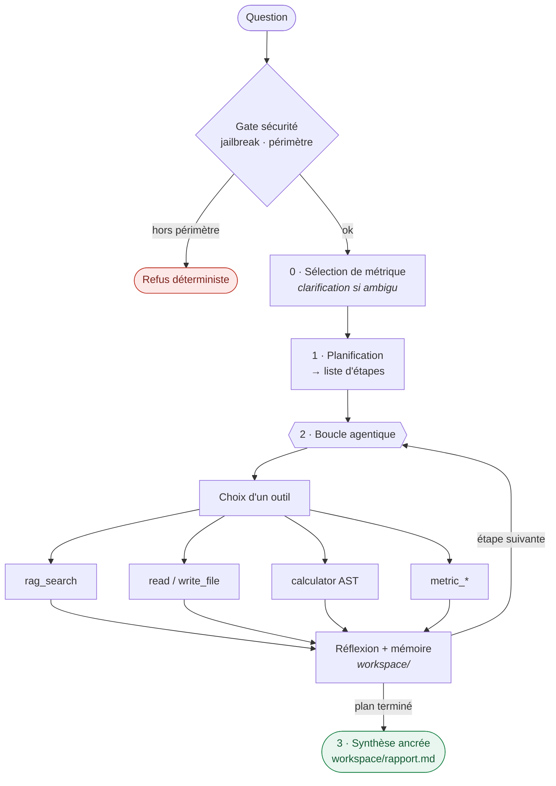

# Mini Deep Agent

**Un agent d'analyse de fonds qui planifie, s'outille et — surtout — n'invente jamais un chiffre.**

[](https://github.com/matteo799/agent-modulaire/actions/workflows/ci.yml)


Un agent minimal, **écrit à la main sans framework agentique** (pas de LangChain, pas
d'AutoGPT), qui transforme un RAG classique en système **agentique** : le LLM planifie,
choisit ses outils, exécute en boucle, garde une mémoire de travail sur disque et synthétise
une réponse finale sourcée. Le RAG n'est plus le cœur du système — c'est **un outil parmi 28**.

> **Cas d'usage — *rating fond*** : répondre à des questions sur des prospectus de fonds
> (KID/DICI) et sur les **métriques d'optimisation** (Sharpe, Sortino, STARR, Martin, budget
> CVaR/drawdown), avec un garde-fou strict : **ne jamais inventer un chiffre absent du corpus.**

## Comment ça marche



| Étape | Où |
|---|---|
| **0.** Sélection de métrique — clarification éventuelle | `agent/finance/` |
| **1.** Planification → liste d'étapes | `agent/planner.py` |
| **2.** Boucle : choix d'outil → exécution → réflexion → mémoire | `agent/executor.py` · `agent/tools.py` |
| **3.** Synthèse finale ancrée sur le livrable | `main.py` |

---

## Organisation du dépôt

Mono-dépôt à **deux niveaux** : un agent minimal écrit à la main, et un moteur RAG
réutilisable traité comme une brique.

| Chemin | Rôle |
|---|---|
| `agent/` | L'agent : `llm.py` (accès LLM + résilience + budget), `planner.py`, `tools.py` (28 outils), `executor.py`, `rag_adapter.py` (adaptateur sur le moteur), `security.py` (anti-détournement), `audit.py` (piste d'audit). |
| `agent/finance/` | Couche métriques *rating fond* : `metrics.py` (calcul pur), `metric_catalog.py`, `select.py` (sélection + clarification). |
| `main.py` | Point d'entrée CLI + synthèse finale. |
| `rag_engine/` | Moteur RAG modulaire (bge-m3 → parent-child → reranker + juge de pertinence LLM). **Sous-package autonome, avec son propre `README.md`** (ce README-ci reste le point d'entrée du projet). |
| `documents/<dataset>/` | Corpus source, **un dossier par dataset**. `finance/` & `droit/` : PDF (KID/prospectus, cours). `amundi/` : **un sous-dossier par ISIN** avec `nav.csv` (historique NAV) + `summary.json` (résumé structuré, remplace le RAG). |
| `workspace/` | Mémoire de l'agent (régénérée à chaque run) : `plan.md`, `notes.md`, `rapport.md`. |
| `tests/` | Trois zones : `unit/` (pytest, rapide), `agent_eval/` (éval de l'agent), `rag_eval/` (éval du moteur) — voir `tests/README.md`. |
| `architecture.md` · `CHOIX_DE_CONCEPTION.md` · `GUARDRAILS.md` | Documentation (voir plus bas). |

---

## Démarrage rapide

```bash
# 1. Installer le moteur RAG (tire les dépendances de récupération : bge-m3, reranker, Qdrant)
pip install -e ./rag_engine

# 2. Clé API (jamais dans la config versionnée) — dans un .env gitignoré à la racine
echo 'RAG__LLM__OPENAI__API_KEY=sk-...' > .env

# 3. Lancer l'agent
python main.py "Analyse les documents internes et fais un résumé des risques."
```

Les documents source vivent dans `documents/<dataset>/`. Pour ajouter un corpus :
déposer les PDF puis (ré)indexer avec le moteur (`python -m rag.ingestion.cli` — voir
`rag_engine/README.md`). L'outil `rag_search` interroge la collection configurée
(**un dataset à la fois**).

---

## Configuration

Tout se règle dans `rag_engine/configs/default.yaml` (l'agent **et** le moteur partagent
le LLM). Les variables d'env `RAG__SECTION__KEY` priment sur la config.

| Clé | Défaut | Effet |
|---|---|---|
| `llm.provider` | `openai` | Passerelle OpenAI-compatible (Claude). `ollama` pour du 100 % local. |
| `llm.openai.model` | `claude-opus-4-8` | Modèle de l'agent **et** du moteur. |
| `llm.max_tokens` | `4096` | Plafond de génération. |
| `vector_store.collection` | `dataset_finance` | Corpus interrogé. `dataset_droit` pour les cours de droit. |

- **Clé API** : uniquement via `.env` (`RAG__LLM__OPENAI__API_KEY`), jamais dans le YAML.
- **Mode 100 % local** : `provider: ollama` + [Ollama](https://ollama.com)
  (`ollama pull qwen2.5:7b`).
- **Éval économe** : forcer un modèle léger via `RAG__LLM__OPENAI__MODEL=claude-haiku-4-5`.

---

## Métriques *rating fond*

Chaque métrique de `metriques_optimisation_gold.md` est exposée comme **un outil**
(`metric_sharpe`, `metric_sortino`, …). Comportement :

- **Calcul best-effort** : calcule si on fournit les entrées (R/σ, ou une série de
  rendements), ou les lit dans le document via `source` (ISIN).
- **Garde-fou honnête** : un KID/DICI ne contient pas de série de rendements → si le calcul
  est impossible, l'outil **explique la métrique sans inventer de chiffre**.
- **Sélection par caractéristiques** : le planner choisit le bon ratio selon l'intention
  (Sharpe vs Sortino…) et **demande une clarification** quand deux se valent.

Détails et règles : `GUARDRAILS.md` et `architecture.md` §7.

---

## Sécurité, gouvernance & observabilité

Les briques attendues d'un agent en production, chacune **garantie par le code** (pas par une
consigne de prompt) — détail complet et lieu d'application dans `GUARDRAILS.md` :

- **Anti-détournement (couche 6, `agent/security.py`)** — gate d'entrée (motifs jailbreak +
  classifieur de périmètre), confinement des lectures/écritures de fichiers, calculateur AST (pas
  `eval`), neutralisation de l'injection indirecte (contenu documentaire = données), normalisation
  anti-obfuscation. Aligné OWASP LLM Top 10.
- **Ancrage / anti-hallucination** — le corpus est le plafond d'information : refus déterministe
  hors-corpus, synthèse ancrée sur le livrable, métriques honnêtes (jamais de chiffre inventé).
- **Budget de run (kill-switch)** — borne dure sur le nb d'appels LLM et le temps mural
  (`AGENT_MAX_LLM_CALLS`, `AGENT_MAX_SECONDS`) : un plan aberrant ne consomme jamais sans plafond.
- **Piste d'audit** — chaque run est journalisé (`logs/audit.jsonl` : requête, sécurité, plan,
  chaque outil + args + résultat, usage, durée) pour tracer une décision et investiguer un
  incident. Best-effort, désactivable `AGENT_AUDIT=0`.
- **Résilience** — dégradation gracieuse par étage : un appel LLM qui échoue ne tue jamais le run.

## Tests & éval

Système non déterministe → tests unitaires sur les parties déterministes + golden sets +
démos rejouables.

```bash
# Tests unitaires (calcul des métriques, outils, sélection, résilience) — rapides, sans réseau
pytest tests/unit

# Agent de bout en bout (golden set)
python tests/agent_eval/run_golden.py

# Récupération du moteur (par dataset, jamais combinés)
python -m tests.rag_eval.run --config tests/rag_eval/configs/eval_finance.yaml
```

### Évaluation — couverture d'outils & ablation modèle

`tests/agent_eval/question_test.yaml` exerce **toute la boîte à outils** (20 questions, 9 catégories) ;
`run_golden.py` mesure automatiquement, par question, la **couverture d'outils**
(`expected_tools ⊆ outils réellement appelés`), la latence et les tokens, agrégés par
catégorie + une matrice des outils exercés. Dernière passe (19 questions, set v2.0) :

| Modèle | Couverture d'outils | Outils exercés | Sélection métrique | Garde-fous |
|---|---|---|---|---|
| **Claude Opus 4.8** | **14/15** | 10/11 | 5/5 ✓ | ✓ |
| Claude Haiku 4.5 | 12/15 | 10/11 | 5/5 ✓ | ✓ |

**Lecture :**
- **Routage arithmétique** — Opus envoie le calcul vers `calculator` sur 14/15 questions ;
  Haiku le néglige sur les 3 tâches multi-étapes (comparaison + calcul) → 12/15. Signal de
  capacité net : le petit modèle sous-utilise l'outil de calcul.
- **Identique sur les deux modèles** — sélection de métrique par l'intention
  (baisse→Sortino, queue→STARR, régularité→Martin, ambigu→clarification), garde-fou honnête
  (Sharpe/Sortino sur un KID = pas de chiffre inventé), refus hors-corpus.
- **Latence/tokens** — la passe Haiku a subi des coupures passerelle (une question ~60 min) :
  le temps mural n'est **pas** une comparaison de vitesse fiable ici, et le harness résilient a
  tout de même terminé. Détail complet : `tests/agent_eval/reports/golden_report_<set>_<modèle>.md`.

```bash
python tests/agent_eval/run_golden.py                                          # modèle par défaut (Opus)
RAG__LLM__OPENAI__MODEL=claude-haiku-4-5 python tests/agent_eval/run_golden.py # ablation Haiku
```

---

## Documentation

**Ce `README.md` est le point d'entrée unique du projet.** Les autres documents sont
subordonnés : les docs de conception à la racine (`architecture.md`, `CHOIX_DE_CONCEPTION.md`,
`GUARDRAILS.md`), `demos/` pour les démos, `tests/README.md` pour les tests, et
`rag_engine/README.md` pour le moteur en tant que sous-package réutilisable.

| Fichier | Contenu |
|---|---|
| **`architecture.md`** | Ce qu'est le système et comment il marche, composant par composant. |
| **`CHOIX_DE_CONCEPTION.md`** | Le *pourquoi* : justification de chaque choix depuis la naissance du projet. |
| **`GUARDRAILS.md`** | Récapitulatif des garde-fous (rejet hors-corpus, calcul honnête, robustesse…). |
| `metriques_optimisation_gold.md` | Définitions de référence des 6 métriques d'optimisation. |
| **`demos/demo_Amundi.md`** | **Démo phare** : l'agent autonome sur 24 questions d'un gérant (dataset Amundi) — trajectoire détaillée par question. |
| `demos/` | Autres sorties de démonstration rejouables (30 questions, comparaison, multi-tâches). |
| `tests/README.md` | Carte des tests : `unit/` · `agent_eval/` · `rag_eval/`. |
| `rag_engine/README.md` | Le moteur RAG (sous-package) : ingestion, stack de récupération, éval. |

---

## Statut & limites

Projet de démonstration, limites assumées (détaillées dans `CHOIX_DE_CONCEPTION.md` §10) :
plan figé (pas de re-planification globale), ingestion manuelle hors agent, calcul
multi-étapes fiabilisé mais non verrouillé, **pas plus d'information que le corpus**
(les ratios exigeant une série de rendements ne se calculent que si on la fournit).
